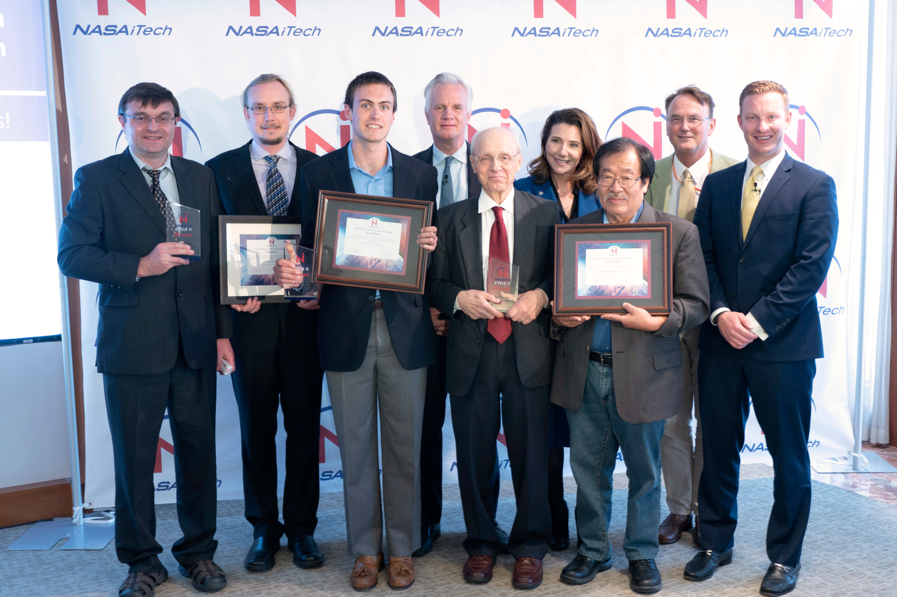

```{r, eval=TRUE, out.width="75%", fig.align='center', fig.alt="The deploy contexts section after clicking the Edit settings button. This section shows three settings that can be edited. The first is the production branch which is set to 'main' in a free text box. The second is deploy previews which is a radio button set to 'any pull request against your production branch/branch deploy branches (as opposed to 'none'). The third is branch deploys which is a radio button set to 'all' (as opposed to 'none' and 'let me add individual branches'). There are two buttons at the bottom of this section, Save and Cancel."}

```

Congratulations to professors Jon Fan and Juan Rivas-Davila! Two of their researchers won the 2018 NASA iTech Forum. The event is a collaborative effort between NASA and the U.S. Department (DOE) of Energy's Advanced Research Projects Agency-Energy (ARPA-E) to find and foster innovative solutions for critical energy challenges on Earth and in space.

The winning project was presented by **Grayson Zulauf** and **Thaibao (Peter) Phan**. Both are PhD candidates. Their collaborative project is developing technology for wireless charging of electric vehicles on Earth, and eventually, Mars. The researchers received invaluable feedback from NASA and DOE's ARPA-E leaders, as well as experts in the field of advanced energy technology.

"NASA is proud to provide a platform for innovators that exposes them to a cadre of industry experts who will be instrumental in the development of their technologies," said Kira Blackwell, NASA iTech program executive for STMD. "NASA's chief technologists and the U.S. Department of Energy's leading subject matter experts provided the teams with a better understanding of requirements for potential infusion of their technologies within a space environment."

Judges selected the top three innovations based on criteria including technical viability, the likely impact on future space exploration, benefits to humanity and commercialization potential. The teams representing the top three entries selected at the end of the forum received a trophy during the recognition ceremony on June 14.

"Our mission at ARPA-E is to change what's possible. We've been delighted to collaborate with NASA for the iTech challenge, to highlight and empower the people driving energy innovation across our country," said Conner Prochaska, senior advisor and chief of staff for ARPA-E. "We look forward to future collaborative opportunities with NASA so, together, we can continue to cultivate the next generation of energy technologies for Americans on the ground and in space."

"It was an honor for Citi to host 'Energy-Tech' thought leaders -- policy makers, academics, scientists, investors and innovators -- for NASA iTech challenge," said Jay Collins, vice chairman of Corporate and Investment Banking at Citi. "We were proud to work with NASA on such an important effort to move energy technology out of the lab and into scalnble solutions for the Moon, Mars and the planet Earth. Congratulations to the winners, whose technological leadership and entrepreneurialism made us all proud."

The top three winners of NASA iTech's 2018 Energy Cycle are listed in alphabetical order:

* **iFeather, Boulder, Colorado**. In-situ Fabrication of Extraterrestrial Aerogels for Transparency, Heat, and Energy Regulation (iFEATHER) for Habitat, Aeronautic and Space Vessel, and Space Suit Applications. Focus area: Innovative Power Management and Distribution
* **Stanford University - Department of Electrical Engineering, Stanford, California**. Two C: Transportation Electrification through Ubiquitous Wireless Charging. Focus area: Innovative Power Management and Distribution
* **WBGlobalSemi, Inc.**, Lakewood Ranch, Florida. Commercializing High Power Silicon Carbide (SiC) Bipolar Junction Transistors (BJTs) and Power Modules for Power Management and Distributed Power Applications. Focus area: Innovative Power Management and Distribution

