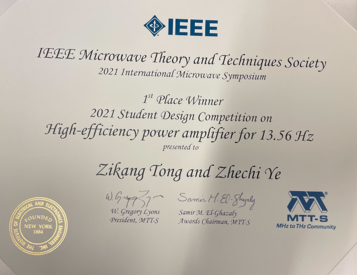

```{r, eval=TRUE, echo=FALSE, out.width="75%", fig.align='center', fig.cap="MTTS award"}

```
IEEE Microwave Theory and Techniques Society

2021 International Microwave Symposium

2021 Student Design Competition on High-efficiency power amplifier for 13.56 MHz 


