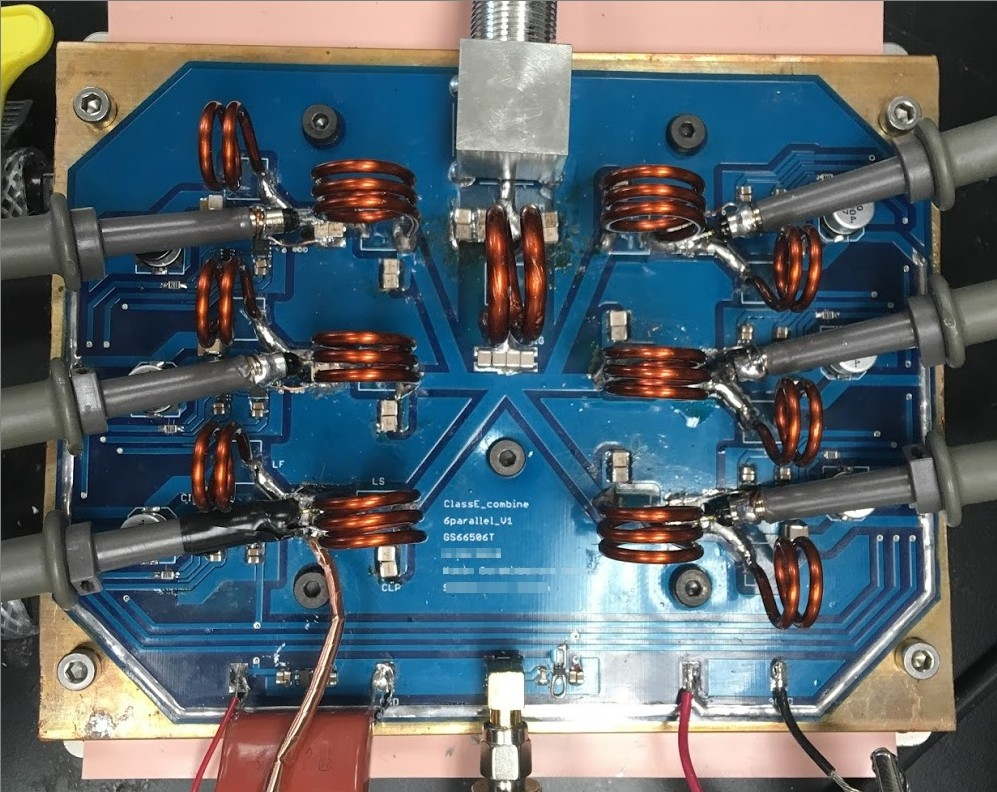

```{r, eval=TRUE, echo=FALSE, out.width="75%", fig.align='center', fig.cap="Photograph of a 40.68MHz PA develped for this project"}

```

# Summary

There are two main objectives centering around making the previously proposed technology viable for generating plasma The first goal is to develop the control technology for multilevel pulsing and arbitrary waveform envelope. The second goal is to improve and expand the mismatch load range of the amplifier.

