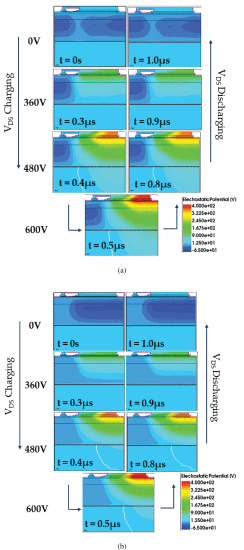

```{r, eval=TRUE, echo=FALSE, out.width="75%", fig.align='center', fig.cap="Electrostatic potential contours under large-signal excitation at 1 MHz. (a) Deep buffer traps added at 0.98 eV. (b) Shallow buffer traps added at 0.5 eV."}

```

# Small- and Large-Signal Dynamic Output Capacitance and Energy Loss in GaN-on-Si Power HEMTs
The origin of Coss and the energy dissipation due to output capacitance can be roughly separated into two types: resistive loss and capacitive hysteresis loss. The resistive losses are due to the resistance of gallium nitride (GaN) buffer layers and Si-substrate. These loss components can be potentially improved by reengineering the doping concentrations in the buffer stacks and substrate layer. However, the capacitive hysteresis loss that is suspected to be due to trapping dynamics remains largely unexplained. This article presents a physics view of the trapping dynamics related to Coss in the GaN high-electron-mobility transistor (HEMT) under small- and large-signal excitations. It is observed that, under large-signal excitation, traps with shallow energy levels (in the range of 0.5 eV above valence band) are mostly responsible for the charge imbalance and energy dissipation. Under small-signal conditions, deep traps with an energy level of around 0.98 eV from the valence band are the causes for the hysteresis at dc. By identifying dominating types of traps and relevant trap energy levels in GaN HEMT, we can gain important insights on how to optimize the device stack design for high-frequency applications.