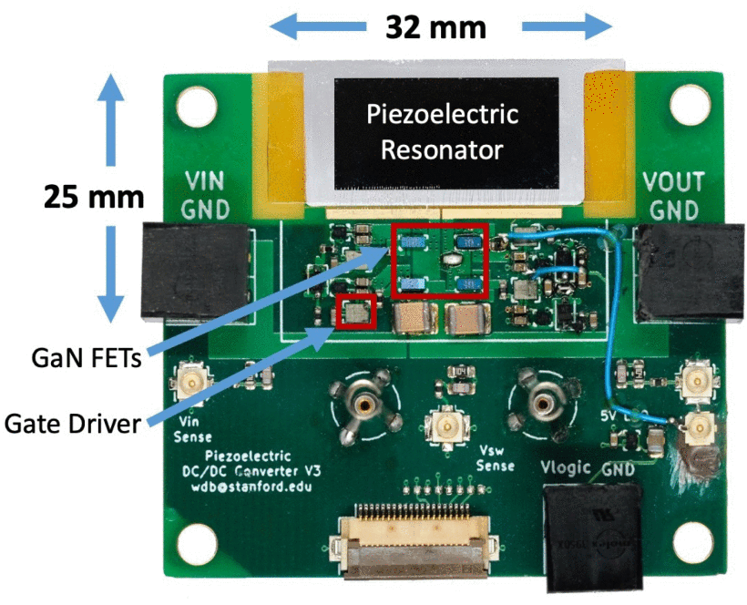

```{r, eval=TRUE, echo=FALSE, out.width="75%", fig.align='center', fig.cap="Electrostatic potential contours under large-signal excitation at 1 MHz. (a) Deep buffer traps added at 0.98 eV. (b) Shallow buffer traps added at 0.5 eV."}

```

The performance of inductors at high frequencies and small sizes is one of the largest limiting factors in the continued miniaturization of dc-dc converters. Piezoelectric resonators can have a very high quality factor and provide an inductive impedance between their series and parallel resonant frequencies, making them a promising technology for further miniaturizing dc-dc converters. In this paper we analyze the impact of resonator parameters on the performance of the piezoelectric resonator based dc-dc converter, derive the optimal load impedance and efficiency limits, and analyze the impacts of varying conversion ratio and load impedance. This work is accompanied by a prototype dc-dc converter using a piezoelectric resonator fabricated from lithium niobate. The piezoelectric resonator has a quality factor of 4178 and a coupling coefficient, $k_t^2$, of 29%. The converter is able to achieve high efficiency zero voltage switching and a continuously variable conversion ratio without the use of any discrete inductors. It achieves a maximum power output of 30.9 W at an efficiency of 95.2% with a power density of 6.76 $\frac{\text {W}}{\text {cm}^3}$.'
summary: 'The performance of inductors at high frequencies and small sizes is one of the largest limiting factors in the continued miniaturization of dc-dc converters. Piezoelectric resonators can have a very high quality factor and provide an inductive impedance between their series and parallel resonant frequencies, making them a promising technology for further miniaturizing dc-dc converters.