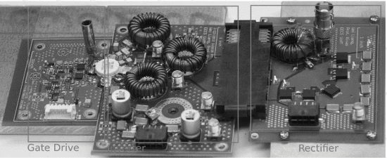

```{r, eval=TRUE, echo=FALSE, out.width="75%", fig.align='center', fig.cap="Converter with wire-wound inductors."}

```

## Abstract 

This paper presents the design and implementation of a high density 150-200 V to 28 V, 200-400 W resonant dc-dc converter with embedded inductors. The converter has a switching frequency of 13.56 MHz and uses air-core toroidal inductors fabricated with printed circuit board (PCB) technology. Implementing toroidal inductors with the PCB reduces inductance variation. Hence, the tuning and implementation of the converter are simplified while achieving high levels of performance and power density. By not using magnetic cores, the inductors also maintain stable values over a wide temperature range. Moreover, the paper discusses the tradeoffs between simplicity and performance of implementing a hard-switched gate drive at megahertz switching frequencies. We describe the advantages of resonant power converter topologies in applications requiring high density and high performance in demanding environmental conditions.