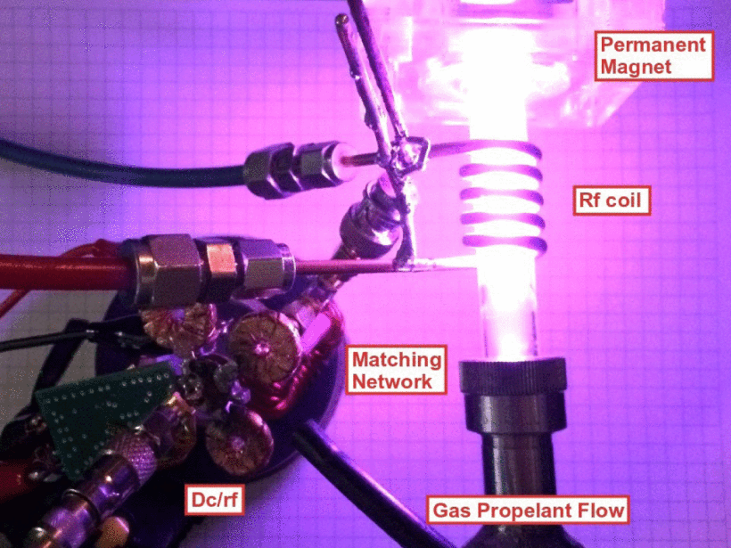

```{r, eval=TRUE, echo=FALSE, out.width="75%", fig.align='center', fig.cap="Helicon running from 3-D printed inverter."}

```

## Abstract 

This paper presents the design of a low-mass RF power inverter at moderate to high power levels (e.g., tens of watts and above) for weight critical applications such as CubeSat plasma thrusters. Our approach for mass reduction includes resonant switching operation at tens of MHz, and the 3-D printing of lightweight scaffolds that form air core inductors after plating with a thin layer of copper. Specifically, we present a 14.2-MHz 50-W resonant dc-RF power inverter implemented with 3-D printed and copper plated air core toroidal inductors. As a demonstration of design flexibility of the 3-D printing process, these toroidal inductors are designed and implemented with optimal cross sections [1] to improve quality factors. The weight of the proposed inverter is reduced by 50% when compared to a 40-W state-of-the-art counterpart in which all the inductors were implemented within the printed circuit board. The inverter achieves 91% electrical efficiency when operated on a 50-Ω resistive load at an input voltage of 50 V. To prove its capability of driving plasma loads, the inverter was first tested with a matching network running an inductively coupled plasma (ICP) in a low-pressure argon ampoule outside vacuum environment. The inverter drew 50 W to run the ICP at an input voltage of 20 V. Then as an example application, the inverter was tested with another specifically tuned matching network to drive a helicon double layer (HDL) plasma intended for CubeSat thruster applications. The HDL plasma was formed in a vacuum chamber and was fed with argon. The combined inverter and matching network outputs 40 W and achieves 86% dc input to plasma efficiency at an input voltage of 40 V.