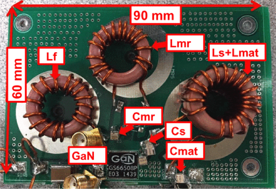

```{r, eval=TRUE, echo=FALSE, out.width="75%", fig.align='center', fig.cap="Implemented class Φ2 inverter with matching network. Lf = 260 nH, LMR = 300 nH, LS = 386 nH, CMR = 114 pF, Cp = 300 pF, Cs = 1 nF, Lmat = 293 nF, and Cmat = 232 pF."}

```

## Abstract 

This letter presents a high-power resonant inverter using an enhancement mode gallium nitride (eGaN) device with magnetic resonant coupling (MRC) coils at 13.56 MHz for wireless power transfer (WPT). The power inverter driving the transmitting coils is based on a class Φ 2 inverter, a single-switch topology with low switch-voltage stress, and fast transient response. The implementation utilizes a recently available eGaN device in a low-inductance package that is compatible with operation in the 10 s of MHz switching frequency. In this letter, we present experimental measurements of the inverter in a WPT application and characterize the system performance over various distances and operating conditions. Before using MRC coils, we evaluated the performance of the class Φ 2 inverter with the eGaN FET. It delivered 1.3-kW output to a 50-Ω load with an efficiency of 95% when a 280-V input voltage was applied. For WPT operation, we added the open-type four-coil unit with a diameter of 300 mm to deliver power over 270-mm distance. With the addition of MRC coils, the class Φ 2 inverter provided 823-W output power with 87% efficiency over 270-mm distance between coils