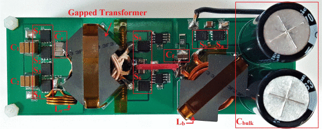

```{r, eval=TRUE, echo=FALSE, out.width="75%", fig.align='center', fig.cap="Photograph of prototype converter, PCB dimension 145× 50 mm."}

```

## Abstract 

This paper demonstrates a two-stage implementation of a step-down power factor preregulator design that achieves a high efficiency across the entire universal input voltage range (85-265 V rms ) for an offline power supply application. In this implementation, a resonant LLC converter supplies power to a boost converter operating in a continuous conduction mode. A variable frequency multiplier technique is used in a resonant LLC converter stage to provide different dc gains and compress the effective input voltage range. The efficiency performance achieved is flatter and higher than other conventional offline power converter design consisting of a boost power factor correction circuit followed by a resonant LLC converter, whose efficiency tends to drop significantly at low-line input voltages. The proposed circuit allows MOSFETs with lower voltage ratings and better conduction/switching characteristics to be used in both converter stages. Both of the LLC stage and boost circuit can be better optimized due to the compressed operation range and better semiconductor switches. A scaling law of power losses versus breakdown voltage requirement for boost circuit under the condition of the same output power is presented. Experimental results demonstrated a flatter high efficiency performance across a wide input range.
