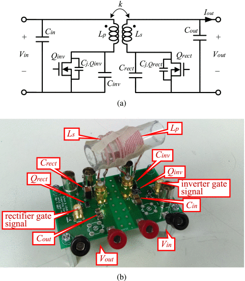

```{r, eval=TRUE, echo=FALSE, out.width="75%", fig.align='center', fig.cap="Class-E dc–dc converter with synchronous rectification. (a) Schematic. (b) Implementation."}

```

## Abstract 

We present an operation scheme for a dc-dc converter consisting of a class-E inverter and a class-E rectifier to always achieve zero-voltage zero-dv/dt switching at a wide range of input and output voltages. To cope with the high sensitivity due to load variations, previous approaches either forgo the zero-dv/dt turnON switching conditions or required additional components and topological changes. Instead, the proposed strategy modulates the duty cycles and switching frequencies depending on the input and output voltages to always achieve zero-dv/dt turn-ON switching and, thus, minimizes switching losses, while preserving the structural simplicity of the converter. Experiments demonstrate the prototype converter maintaining the desired soft-switching condition under 80-200-V input voltage and 5-20-V output voltage variations. In an additional prototype, we implemented a similar design with synchronous rectification that achieves a peak efficiency of 92.3% at an input voltage of 80 V, an output voltage of 12 V, and an output power of 26.9 W