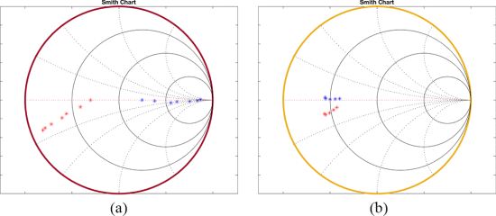

```{r, eval=TRUE, echo=FALSE, out.width="75%", fig.align='center', fig.cap="Impedance variation after connecting the PCN. (a) Distance variations. (b) Horizontal alignment variations."}

```

## Abstract 

This paper presents an impedance compression network (ICN) design in a wireless power transfer (WPT) system to compensate for distance or alignment variations between coils. In midrange WPT applications, magnetic resonant coupling coils are mainly implemented to achieve high efficiency for charging batteries. However, a distance or horizontal alignment variation between coils changes their coupling coefficient, and it decreases the overall performance of WPT systems because the zero voltage switching in a resonant inverter is lost. In order to reduce coil impedance variation, we propose an ICN that compresses variations in coil impedance. The ICN consists of a resistance compression network and a phase compression network to suppress magnitude and phase variations, respectively, in the coil impedance. Only passive components, such as inductors and capacitors, are used to implement an ICN.