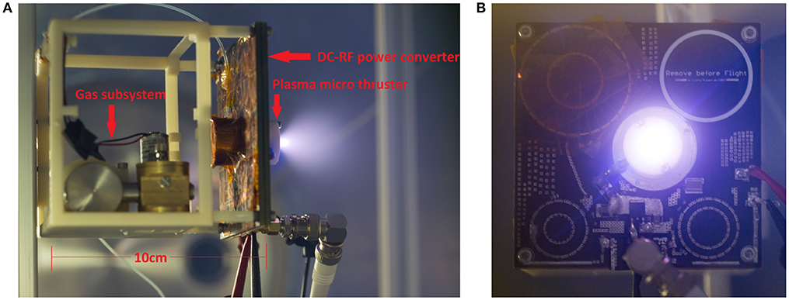

```{r, eval=TRUE, echo=FALSE, out.width="75%", fig.align='center', fig.cap="Operational testing of the integrated micro-thruster/power inverter 1 U CubeSat assembly in the ANU WOMBAT space simulation facility (A) side-view also showing gas subsystem integrated prototype. (B) front-view demonstrating successful vacuum testing (no parasitic discharge) under space conditions."}

```

## Abstract 

Progress in satellite technologies is ongoing and eventually finds applications back on Earth. Electric propulsion systems have been proven effective on large scale satellites (NASA DAWN) with better propellant efficiency than chemical or cold gas propulsion, and if miniaturized can be promising for long term operation of nano-satellites (e.g., CubeSats) in low Earth orbit or in deep space (NASA MarCO). However, the power supplies often used to power these electric thrusters, particularly those involving radiofrequency (RF) plasma, typically comprise power inefficient linear mode RF power amplifiers (e.g., class AB). These are simple systems designed to operate reliably under a wide range of loads for versatility, but they suffer low power efficiencies when operating at conditions significantly different from the nominal operating point. The required bulky and heavy thermal management components deem these electric propulsion systems impossible to fit on board nano-satellites. Here we present a compact and efficient switched mode dc-RF power inverter integrated with an electro-thermal plasma micro-thruster for nano-satellite (e.g., Cubesats) propulsion. The integrated system can serve as side panels and structural support of CubeSats, saving precious on-board volume for propellant and/or payloads. A complete assembly has been operationally tested in a space simulation system. This development opens a route for a new generation of power supplies applicable to the space sector, the microelectronics industry as well as the field of bioengineering.