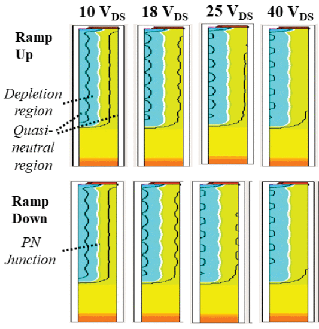

```{r, eval=TRUE, echo=FALSE, out.width="75%", fig.align='center', fig.cap="Simulated depletion region (at 10 MHz) across VDS with positive- and negative-going dc bias at 0.5s-ramp rate."}

```

## Abstract 

Small-signal measurements of output capacitance ( $C_{OSS}$ ) are ubiquitous in power semiconductor datasheets and determine critical features of power converters. For silicon superjunction power MOSFETs (SJs), we report $C_{OSS}$  measurements with two key anomalies: variation with ac perturbation frequency and hysteresis with dc sweep direction. Using mixed-mode simulations, we attribute the frequency shift to the fundamental SJ structure and find that dc hysteresis is caused by charge trapping from uneven depletion fronts. We show that $C_{OSS}$  measurements on SJs do not accurately characterize large-signal operation, underestimating stored energy by up to four times and giving no indication of $C_{OSS}$ losses.