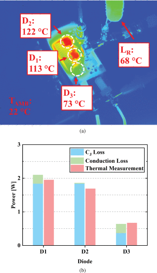

```{r, eval=TRUE, echo=FALSE, out.width="75%", fig.align='center', fig.cap="FLIR thermal camera images of the rectifier setup as well as the loss breakdown from CJ (calculated from Sawyer–Tower measurement fitting), conduction (obtained from simulation), and thermal measurement [calculated using (6)]. (a) Device temperatures. (b) Device losses."}

```

## Abstract 

In high-frequency (HF) and very-high-frequency (VHF) rectifiers, silicon carbide (SiC) Schottky diodes exhibit higher losses compared to what is reported in manufacturer-provided simulation models, with additional power loss stemming from energy dissipation during the charging and discharging of the junction output capacitance (CJ). Because these losses are not included in manufacturer simulation models and have not been well-studied for commercially available SiC Schottky diodes, we have experimentally measured them using the Sawyer-Tower circuit. From these measurements, we compare the losses across manufacturers, current rating, generation, voltage rating, and packaging. We then demonstrate the performance of these devices on a 20-MHz class-DE rectifier and compare their power dissipation from the simulation and experimental measurements. Finally, by incorporating these losses in device power dissipation calculations in various rectifier topologies, we propose suggestions on device selection to optimize converter efficiencies.