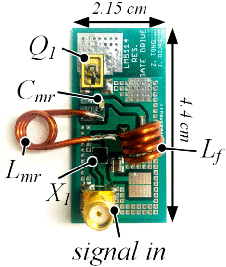

```{r, eval=TRUE, echo=FALSE, out.width="75%", fig.align='center', fig.cap="Photograph of multiresonant gate driver PCB."}

```

## Abstract 

In this paper, we explore the challenges of implementing resonant converters using silicon carbide (SiC) power devices at high frequency: namely, the issue of high parasitic inductance packages and the ability to drive and enhance the mosfet at these frequencies. Although power circuit designers have many alternative device technologies to choose from, such as silicon and gallium nitride materials, SiC devices have several advantageous attributes especially in high power applications. As a solution, we study the device performance and parasitics of SiC mosfets in different packaging schemes. We further offer a solution to the challenges of driving SiC devices by demonstrating a multiresonant gate driver and use this scheme to drive an SiC mosfet at 30 MHz and a SiC JFET at 13.56 MHz in a class-E inverter, achieving 85.7% drain efficiency for the mosfet and 93.8% for the JFET.