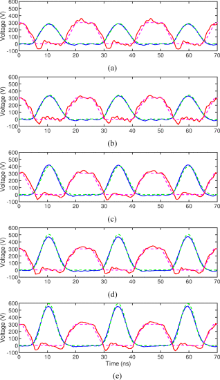

```{r, eval=TRUE, echo=FALSE, out.width="75%", fig.align='center', fig.cap="Comparison between the measured and simulated drain voltage (blue and green–1×) and gate voltage (red and pink–50×) waveforms from the experiment B with variable-resistance Class-E power amplifiers. (a) 85 V. (b) 100 V. (c) 115 V. (d) 130 V. (e) 145 V."}

```

## Abstract 

Class-E power amplifiers have regained academic interest over the past decades due to the introduction of new high-performance wide-bandgap semiconductor devices and the increasing demand for high-efficiency power amplifiers. While these power devices, notably GaN HEMTs, have exceptional performance at megahertz operation, they also display an additional loss component due to C oss at this frequency. Unfortunately, the dependence of this loss term on the peak voltage and the device size is the opposite of that of the conduction loss. In this article, we mathematically analyze the operation of a Class-E amplifier to find the optimal input voltage and device sizing where the sum of these two losses is minimized. From this analysis, we have found that the common design approach of maximizing device voltage rating and area to get the best efficiency no longer holds for some operating conditions. Furthermore, we examine the constraints that dictate when this optimization equations can and cannot be used, as well as propose a distributed loss model for the C oss loss based on a generalized Steinmetz equation (GSE) to allow this new loss term to be easily simulated. To verify our mathematical analysis and to demonstrate the applications of the proposed GSE-based C oss loss model, two design examples are provided. They consist of a choke-input Class-E amplifier at 10 MHz and a variable-resistance Class-E amplifier at 40.68 MHz. The experimental results on these two design examples show good agreements with our analysis.