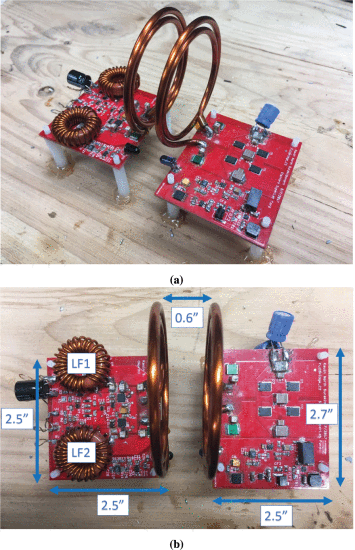

```{r, eval=TRUE, echo=FALSE, out.width="75%", fig.align='center', fig.cap="WPT system with the push–pull class-E inverter on the left and the FB rectifier on the right. Note that both C1 and C2 are split into two for symmetry on the board. (a) Side view. (b) Top view."}

```

## Abstract 

Wireless power transfer (WPT) systems have attracted tremendous attention over the past decade. Most compact, low-power, WPT systems, however, utilize ferrites to shield and redirect the magnetic fields. Using a magnetic material adds the weight and system bulk. In this article, we present a method to design the WPT coils in which the leakage and magnetizing inductances are utilized in other parts of the circuit. This eliminates the need for discrete inductors commonly required in a resonant inverter, which additionally improves overall efficiency. Utilizing this technique, we demonstrate a small and lightweight 300-W 48-to-48-V WPT system with above 90% efficiency. We further propose a method to eliminate the input inductor required by the class-E inverter by utilizing the input power supply wires. Employing this method, we demonstrate a printed circuit board (PCB)-based WPT circuit operating at 40.68 MHz, utilizing no discrete inductors other than the WPT coils themselves and weighing only 7 g. This article describes the design methodology as well as the procedure to eliminate the discrete resonant inductors used in the implementation of our designs.