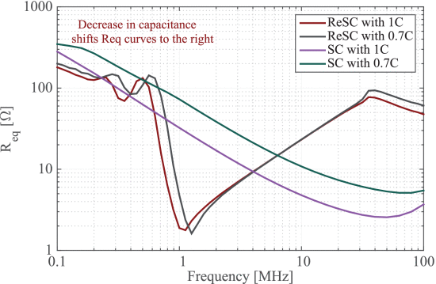

```{r, eval=TRUE, echo=FALSE, out.width="75%", fig.align='center', fig.cap="Equivalent output resistance (Req ) of a 1:4 ReSC converter and a 1:4 SC converter. Reducing the capacitances by 30% results in a larger Req in both converters. Minimum Req of the ReSC converter is obtained at 1 MHz. Reducing the capacitances by 30% causes its Req to miss the minimum point at 1 MHz."}

```

## Abstract 

Class 2 ceramic capacitors, such as X7R, have relatively high energy density compared to Class 1 ceramic capacitors. However, they experience changes due to aging, temperature, and electric field. The measured X7R capacitance drop is 1%-2% per decade hour due to aging, 18% due to a temperature change from 25 °C to 125 °C, and 75% due to an applied voltage that is 80% of the rated voltage. The measured equivalent series resistance (ESR) of the X7R capacitors shows an increase of 20% to 70% due to aging of 1680 h, and a 50% fluctuation in value when we apply 20% to 80% of the rated voltage. In switched-capacitor (SC) and resonant SC (ReSC) converters, these variations can shift a converter's operating point and result in higher equivalent output resistance and lower efficiency. We quantified the converter performance degradation caused by capacitor variations in the simulation and demonstrated the results by implementing a 1 MHz 25 W 1:4 Dickson ReSC converter. The converter efficiency decreases from 93.1% to 90.7% as a result of capacitor variations mainly due to the aging effect.