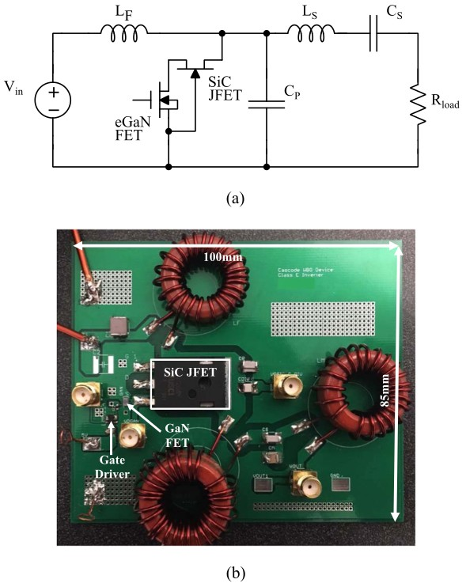

```{r, eval=TRUE, echo=FALSE, out.width="75%", fig.align='center', fig.cap="Schematic and PCB of the Class-E inverter using the cascode GaN/SiC device. (a) Class-E inverter schematic. (b) Class-E inverter PCB."}

```

## Abstract 

Wireless power transfer systems and plasma generators are among the increasing number of applications that use high-frequency power converters. Increasing switching frequency can reduce the energy storage requirements of the passive elements that can lead to higher power densities or even the elimination of magnetic cores. However, operating at higher frequencies requires faster switching devices in packages with low parasitics. Wide-bandgap (WBG) power devices, such as gallium nitride (GaN) and silicon carbide (SiC) devices, have high-critical fields and high-thermal conductivity that make them good candidates for efficient high-voltage and high-frequency operations. Commercially available GaN and SiC devices have ratings targeting different applications. Lateral GaN devices dominate in lower voltage(<; 650V) and high-frequency applications as they have relatively small device capacitances (C oss , C iss ), which make them easy to drive at high frequencies. On the other hand, vertical SiC devices are often used in high-voltage and low-frequency applications since they have higher blocking voltages and larger gate charge than their GaN counterparts. As a result, SiC devices usually require high power and complicated gate drive circuitry. Recent work shows that in both GaN and SiC devices, losses in device C oss can exceed the conduction losses at high-switching frequencies and relatively high voltages under zero-voltage-switching conditions. Moreover, the C oss energy loss (E oss ) per switching cycle increases with frequency in GaN devices but remains roughly independent of frequency in SiC devices. This means that at high frequencies, SiC devices can be preferable due to their smaller C oss energy loss even when taking into consideration the complexity of the gate drive circuit. In this article, we present a WBG high-voltage cascode GaN/SiC power device, combining the advantages of both a GaN and an SiC device-namely, simple gate drive requirements, E oss loss per cycle roughly independent of frequency, and relatively high-voltage blocking capability. Comparing this cascode GaN/SiC device with an SiC MOSFET and a SiC junction gate field-effect transistor of similar voltage ratings and R d8,ON , we find that the inverter using the cascode GaN/SiC device has the highest efficiency and simplest auxiliary gate drive circuitry. Finally, integrating the cascode GaN/SiC device has the potential benefits of achieving lower C oss losses, higher device ratings, and better heat removal capability