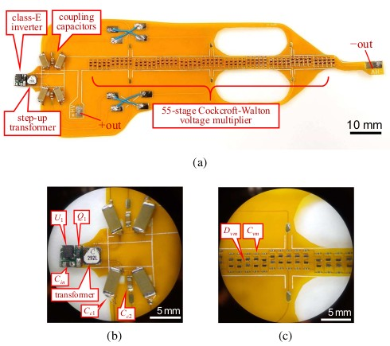

```{r, eval=TRUE, echo=FALSE, out.width="75%", fig.align='center', fig.cap="Photograph of the implemented high voltage power supply. Scale bar is located in bottom right corner of each picture. (a) Overall view. (b) Close-up view of the inverter, transformer, and coupling capacitors. (c) Close-upview of the voltage multiplier."}

```

## Abstract 

The limited in-flight battery lifetime of centimeter-scale flying robots is a major barrier to their deployment, especially in applications which take advantage of their ability to reach high vantage points. Perching, where flyers remain fixed in space without use of flight actuators by attachment to a surface, is a potential mechanism to overcome this barrier. Electroadhesion, a phenomenon where an electrostatic force normal to a surface is generated by induced charge, has been shown to be an increasingly viable perching mechanism as robot size decreases due to the increased surface-area-to-volume ratio. Typically electroadhesion requires high (>1 kV) voltages to generate useful forces, leading to relatively large power supplies that cannot be carried on-board a micro air vehicle. In this letter, we motivate the need for application-specific power electronics solutions for electroadhesive perching, develop a useful figure of merit (the “specific voltage”) for comparing and guiding efforts, and walk through the design methodology of a system implementation. We conclude by showing that this high voltage power supply enables, for the first time in the literature, tetherless electroadhesive perching of a commercial micro quadrotor.