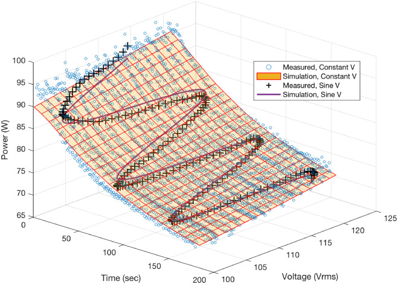

```{r, eval=TRUE, echo=FALSE, out.width="75%", fig.align='center', fig.cap="Refrigerator power vs. time and voltage for model predictions and collected data."}

```

## Abstract 

Developments in simulation and distributed control of distributed energy resources require increasingly granular characterization and modeling of load behavior. Previous work has demonstrated the viability of voltage-based power control of residential appliances to enable load flexibility without service interruption. However, conventional static and dynamic load models fail to capture the coupled voltage and state dynamics relevant for this type of control. We develop a new class of dynamic load models for residential appliances. The input-output dynamics are learned by varying input voltage, which is enabled by custom hardware capable of controlling single-phase AC voltage and collecting high-resolution measurements. We estimate model parameters using nonlinear least squares regression and particle swarm optimization. The RMSE of power predictions is significantly reduced for loads with coupled time and voltage dynamics relative to traditional models. Using these models for voltage-based power control can help improve the ability of DERs to provide grid services.

