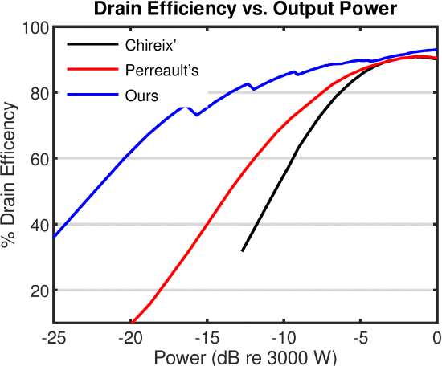

```{r, eval=TRUE, echo=FALSE, out.width="75%", fig.align='center', fig.cap="A comparison between the efficiency vs output power of our proposed system (blue), Perreault's (red), and Chireix's (black)."}

```

## Abstract 

Radio frequency (RF) power amplifiers are an integral part of many academic, medical, and industrial applications. For many of these applications, the RF power needs to quickly transition from one level to another. For switched-mode amplifiers, one way to achieve this is with an out-phasing modulation technique. This power control technique, however, presents its own disadvantages, including poor light-load efficiency and an increase in overall system size. In this paper, we present an alternative power modulation method to create a high-efficiency high-speed RF amplifier system. This control technique utilizes two mechanisms, modular on/off and phase-shifting. In modular on/off, a different number of sub-circuits are turned “on” or “off” to crudely adjust the output power. In phase-shifting, the smallest sub-circuit of the whole system is phase-shifted away from the rest of the circuit to fine-tune the output power. This system's performance is first compared with existing out-phasing systems via circuit simulation. Then, an actual circuit implementation with a 13.56-MHz, 1500-W RF amplifier is demonstrated. A 93% dc-to-RF efficiency is achieved at full load, and above 80% efficiency is maintained all the way down to 7% load.