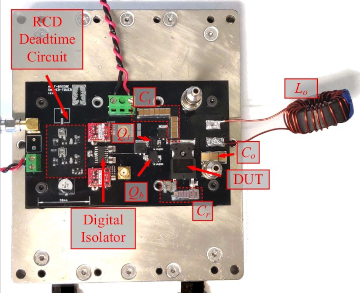

```{r, eval=TRUE, echo=FALSE, out.width="75%", fig.align='center', fig.cap="Photograph of the half-bridge Sawyer-Tower setup."}

```

## Abstract 

The recent development and commercialization of wide bandgap (WBG) power semiconductors, specifically gallium nitride (GaN) and silicon carbide (SiC), has driven the increase in switching frequency for soft-switching power converters like the Class E, Class Φ2, and Class DE resonant inverters and rectifiers. However, prior literature has characterized numerous commercial GaN and SiC devices using the Sawyer-Tower circuit and discovered significant large-signal charge-voltage hysteresis of the Coss. This Coss hysteresis, equivalent to off-state energy loss, is highly dependent on the frequency and voltage across the device, hindering the efficiency and performance of MHz range soft-switched converters. This paper is the first to explain the origin of the Coss loss in SiC power devices as charging and discharging conduction loss at the termination of the device. The loss characteristics relative to operating voltage, frequency, dV=dt, and temperature are dictated by incomplete ionization. Incomplete ionization also highlights a significant inconsistency between the large-signal Coss behavior and small-signal behavior, which is often the model used in manufacturers’ datasheets and SPICE simulations. The large-signal charge-voltage behavior is transient, where the charge in the Coss depends on the rate of the voltage swing across the device. We validate these hypotheses through mixed-mode simulations using Sentaurus® Technology Computer-Aided Design (TCAD) and experimentally using commercial and custom SiC devices.
