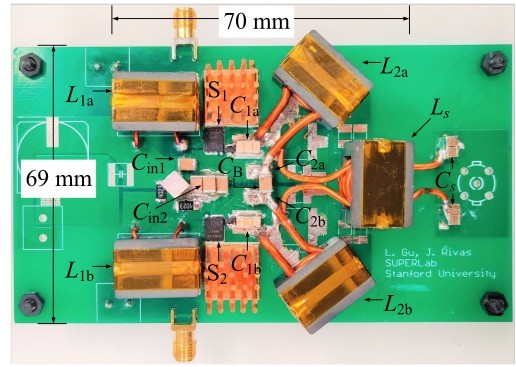

```{r, eval=TRUE, echo=FALSE, out.width="75%", fig.align='center', fig.cap="Prototype series-stacked PPT Φ2 amplifier."}

```

## Abstract 

The Class Φ2/EF2  amplifier is an attractive topology for high-voltage and high-frequency power conversion because of the high efficiency, reduced device voltage stress, simplicity of gate driving, and load-independent ZVS operation. Due to many degrees of freedom for tuning, previous studies can only solve the single-ended Φ2  circuit using numerical methods. This work focuses on improving the design and operating characteristics of a push–pull Φ2  amplifier with a $T$ network connected between the switch nodes, or a PPT Φ2  amplifier. The PPT Φ2  amplifier has less circulating energy and achieves higher cutoff frequency <sub>T</sub> than other Φ2/EF<sub>2</sub> circuits. We, then, present a series-stacked input configuration to reduce the switch voltage stress and improve the efficiency and power density. A compact 6.78-MHz, 100-V, 300-W prototype converter is demonstrated that uses low-cost Si devices and achieves 96% peak total efficiency and maintains above 94.5% drain efficiency across a wide range of voltage and power. Together with the advances in wide-bandgap semiconductors and magnetic materials, the PPT $\Phi _\text2$ circuit opens more possibilities for the state-of-the-art performance of solid-state RF amplifiers in high-frequency, high-power applications, including wireless charging for electric vehicles, plasma RF drives, and nuclear magnetic resonance spectroscopy.