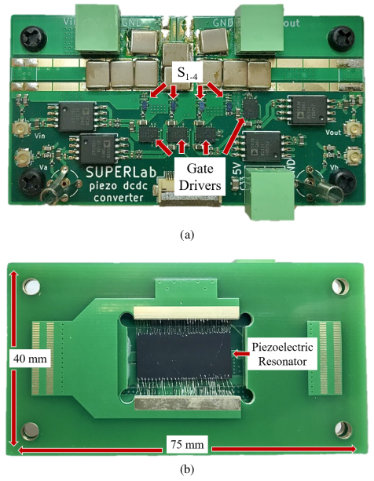
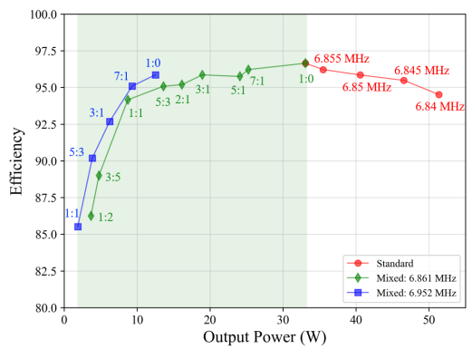

```{r, eval=TRUE, echo=FALSE, out.width="75%", fig.align='center', fig.cap="Prototype converter consisting of (a) the power board and (b) the resonator carrier board attached underneath the power board."}

```

```{r, eval=TRUE, echo=FALSE, out.width="75%", fig.align='center', fig.cap="Efficiency as a function of output power for both standard and mixed sequences. Green shading highlights the output power range enabled by fixed-frequency control."}

```

## Abstract 

Piezoelectric resonators have shown promise as efficient, power-dense energy storage element alternatives to continue the miniaturization of DC-DC converters. However, practical piezoelectric resonators diverge from their ideal behavior due to spurious modes that cause high loss regions throughout their operating frequency range. Typically, control of piezoelectric resonator DC-DC converters is constrained to unidirectional power flow each resonant cycle for maximum efficiency operation. However, output power depends on the frequency with such control, which means the converter cannot operate at loads corresponding to spurious mode frequencies. This paper presents a fixed-frequency control mode utilizing the high-quality factor of piezoelectric resonators to avoid spurious modes. The fixed-frequency control enables efficient operation spanning the converters full load range, demonstrated through a prototype DC-DC converter with a custom fabricated lithium niobate resonator. 

At a conversion ratio of 60 V to 30 V, spurious modes limit the converters operating range from 33 W to 51 W using unidirectional power-constrained control, yet the fixed-frequency control extends operation from 33 W to 2 W.

