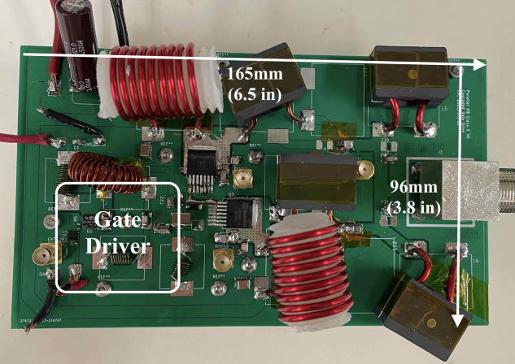

```{r, eval=TRUE, echo=FALSE, out.width="75%", fig.align='center', fig.cap="PCB of the wideband Class E power amplifier."}

```

```{r, eval=TRUE, echo=FALSE, out.width="75%", fig.align='center', fig.cap="Measured output power and efficiency of the wideband Class E power amplifier across the 2 MHz bandwidth centered at 13.56 MHz."}

```

## Abstract 

Class E power amplifiers are widely used in high- frequency applications due to their simplicity and use of only one ground-referenced switch. However, Class E power amplifiers are usually tuned to operate at a fixed frequency due to their resonant nature. Extending the bandwidth of these switch-mode power amplifiers is beneficial in many applications, such as plasma generators and wireless power transfer systems. In this paper, we present a 1 kW wideband Class E power amplifier using Silicon Carbide (SiC) MOSFETs that achieves 93% efficiency at 13.56 MHz with a bandwidth of 1 MHz. We incorporate a reactance compensation network in the output loading stage to achieve wideband operation; design a custom gate drive circuit to reduce the gate power loss and improve thermal performance compared to using a gate driver IC. The total gate power of one SiC device is measured to be 1.55 W at 13.56 MHz.
