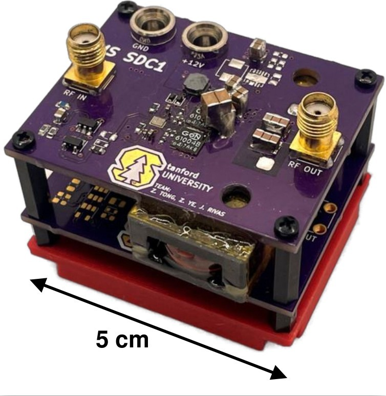
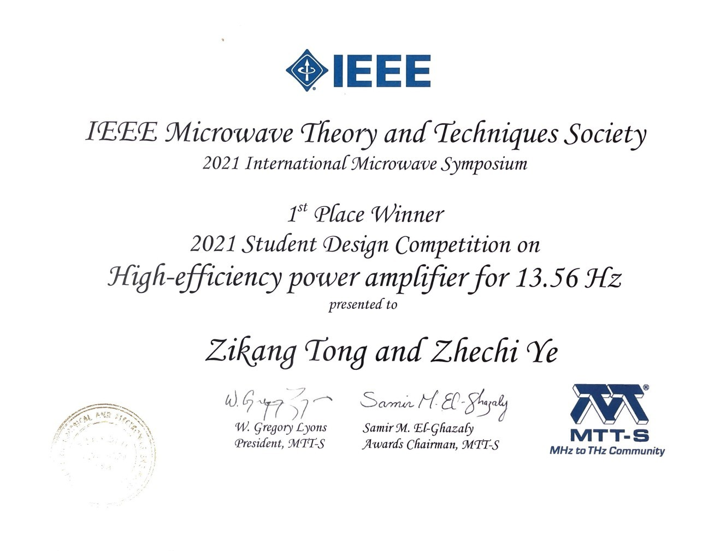

```{r, eval=TRUE, echo=FALSE, out.width="75%", fig.align='center', fig.cap="13.56 MHz Converter"}

```


```{r, eval=TRUE, echo=FALSE, out.width="75%", fig.align='center', fig.cap="MTTS award"}

```


## 2021 Student Design Competition on High-efficiency power amplifier for 13.56 MHz 

The 2021 IEEE International Microwave Symposium (IMS) was held in June 7-10 at Atlanta, Georgia. IMS is one of the largest events for the RF and Microwave Industry attended by hundreds of academic institutions and companies across the world. During this conference, student attendees were able to participate in a Student Design Competition. The participants were asked to design and build a radio frequency (RF) power amplifier capable of delivering 10-11 W of power at 13.56 MHz. The designs were ranked based on the efficiency of the amplifier defined as the ratio of delivered output power at 13.56 MHz to the input power from the DC supply. The team of Zikang Tong and Zhechi Ye from Prof. Juan Rivas’s Stanford University Power Electronics Laboratory received the First Place award for the competition, where their developed amplifier achieved 87% efficiency.


* 10-11 W output power at 13.56 MHz
* 12 V DC Supply Voltage
* 50 Ohms load impedance
* 10 mW External Signal Source
* Input SWR: < 2:1 relative to 50 Ohms
* Harmonics: < -40 dBc (up to 100 MHz)
* Non-harmonic spurs: < -70 dBc (10 kHz to 100 MHz).

